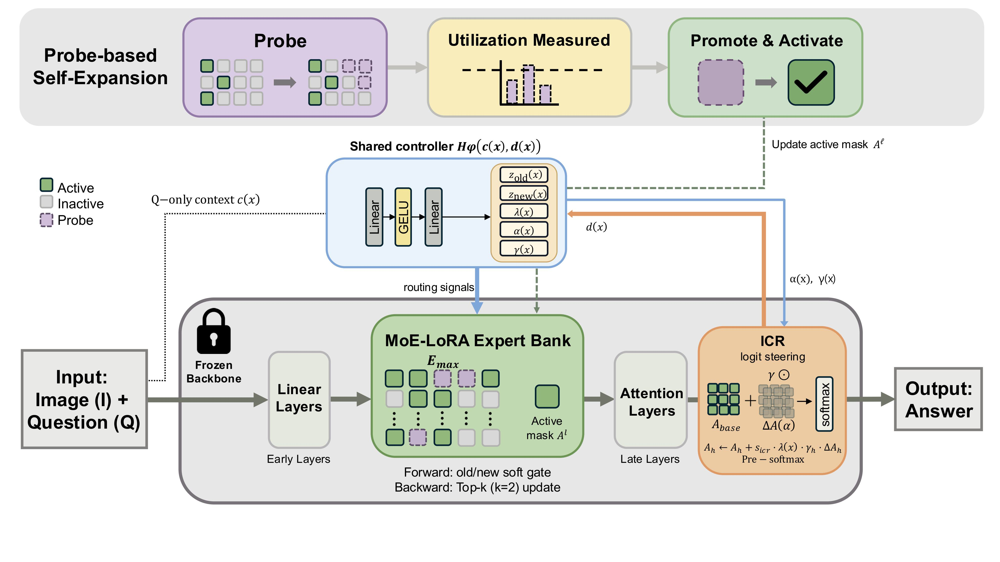

<div align="center">
  <h1>Q-STEER</h1>
  <h3>Attention-Logit Steering to Compositional Generalization for Continual VQA</h3>
  <p>
    <strong>Suyoung Yang</strong><br>
    Department of Artificial Intelligence, Yonsei University<br>
    Seoul, Republic of Korea<br>
    suyoung425@yonsei.ac.kr
  </p>
  <p>
    
    
    <a href="#citation"></a>
    <a href="LICENSE"></a>
  </p>
  
</div>

---

## Abstract

Continual visual question answering (VQA) requires learning new question types while retaining previously acquired visual grounding and reasoning. Existing methods mainly reduce parameter interference, but do not explicitly control how sequential adaptation changes the coupling between a question and its visual evidence.

We propose **Q-STEER**, a task-agnostic framework that separates plasticity from retention through a shared question-conditioned controller. For plasticity, probe-based MoE-LoRA self-expansion activates new expert slots only when the current capacity is insufficient. For retention, a KL-based late-layer attention-drift signal conditions a low-rank correction to attention logits; the drift is diagnostic rather than an attention-matching loss.

On continual VQA v2, **Q-STEER** obtains **53.68** average performance and **4.51** average forgetting, and reaches **51.00 / 51.48** on Novel / Seen compositional splits. Experiments on a heterogeneous visual-instruction stream, together with seed, ablation, grounding, sensitivity, and overhead analyses, support the effectiveness of drift-aware steering and on-demand expansion.

---

## Method at a Glance

**Q-STEER** addresses task-agnostic continual VQA by jointly controlling capacity expansion and question-evidence coupling retention.

- **Question-conditioned controller**  
  Uses question-only context and an attention-drift signal to produce routing and steering signals.

- **Probe-based MoE-LoRA self-expansion**  
  Activates new expert slots only when existing capacity is insufficient for the incoming task.

- **Factorized old/new expert routing**  
  Separates carried-over and newly promoted expert banks to reduce direct routing interference.

- **Drift-aware attention-logit steering**  
  Applies an input-conditioned low-rank correction to late-layer attention logits using KL-based attention drift.

- **Task-agnostic inference**  
  Performs routing and steering without access to task identifiers.

---

## Results at a Glance

<table>
  <thead>
    <tr>
      <th align="left">Setting</th>
      <th align="right">AP ↑</th>
      <th align="right">AF ↓</th>
      <th align="right">Novel ↑</th>
      <th align="right">Seen ↑</th>
    </tr>
  </thead>
  <tbody>
    <tr>
      <td>Continual VQA-v2</td>
      <td align="right"><strong>53.68</strong></td>
      <td align="right"><strong>4.51</strong></td>
      <td align="right"><strong>51.00</strong></td>
      <td align="right"><strong>51.48</strong></td>
    </tr>
    <tr>
      <td>Heterogeneous CVIT stream</td>
      <td align="right"><strong>85.15</strong></td>
      <td align="right"><strong>4.33</strong></td>
      <td align="right">-</td>
      <td align="right">-</td>
    </tr>
  </tbody>
</table>

---

## Scope of This Release

This repository provides **selected implementation modules** and **reproducibility materials** for Q-STEER.

The current release includes selected Q-STEER modules, configuration examples, evaluation utilities, result tables, and implementation notes. It is intended to document the core components of the method and support verification of the reported metrics.

This repository is **not** a one-command end-to-end training release. Additional cleanup may be added over time.

---

## Citation

If you find this work useful, please cite:

```bibtex
@inproceedings{yang2026qsteer,
  title     = {Attention-Logit Steering to Compositional Generalization for Continual VQA},
  author    = {Yang, Suyoung},
  booktitle = {European Conference on Computer Vision (ECCV)},
  year      = {2026}
}
```

---

## License

This repository is released under the MIT License. See [LICENSE](LICENSE) for details.

Third-party datasets, pretrained models, and external libraries are subject to their respective licenses.
